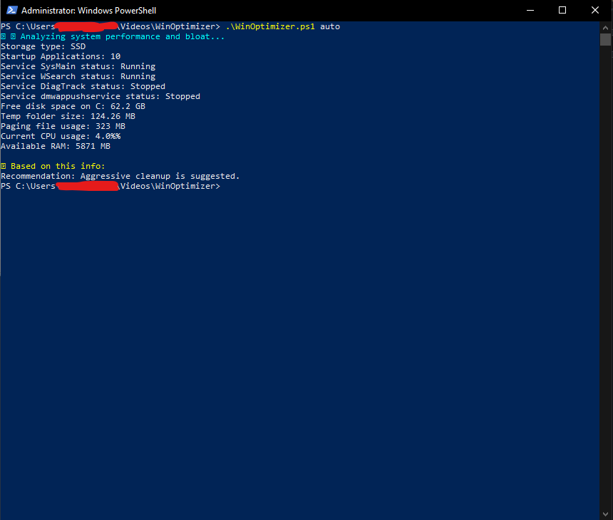
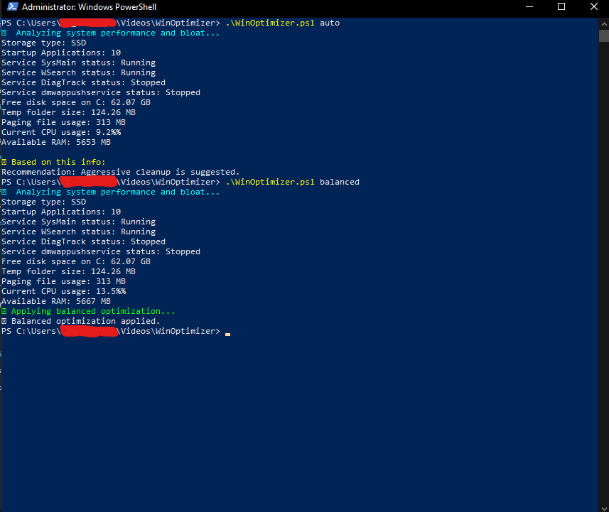

# WinOptimizer 💻✨


## 📌 Overview
WinOptimizer is a **PowerShell-based system analysis and optimization tool** for Windows.  
It detects your storage type, analyzes system performance, and recommends actions such as cleanup, service tuning, and startup app management.

---

## 🚀 Features
- **Automatic hardware detection** (SSD / HDD)
- **Startup application analysis**
- **Service status check** (SysMain, WSearch, etc.)
- **Disk space and temp folder analysis**
- **Paging file usage report**
- **Recommendation engine** — suggests the best optimization level (aggressive / balanced / rollback)

---

## 📸 Screenshots
### Analysis Mode


### Recommendations


---

## 📂 Installation
1. Download the repository or clone it:
   ```powershell
   git clone https://github.com/yourusername/WinOptimizer.git
   ```
2. Navigate to the folder:
   ```powershell
   cd WinOptimizer
   ```
3. Run the script in **analysis mode**:
   ```powershell
   .\WinOptimizer.ps1 auto
   ```

---

## ⚙️ Usage
```powershell
# Analyze system performance and get recommendations
.\WinOptimizer.ps1 auto

# Force aggressive cleanup
.\WinOptimizer.ps1 aggressive

# Force balance cleanup
.\WinOptimizer.ps1 balanced

# Rollback changes
.\WinOptimizer.ps1 rollback
```

---

## 📜 License
This project is licensed under the MIT License — see the [LICENSE](LICENSE) file for details.

---

## 🤝 Contributing
Pull requests are welcome! For major changes, please open an issue first to discuss what you’d like to change.

---

**Author:** [Dirga Rahman](https://github.com/dirgarahman)  
**Version:** 1.0.0
