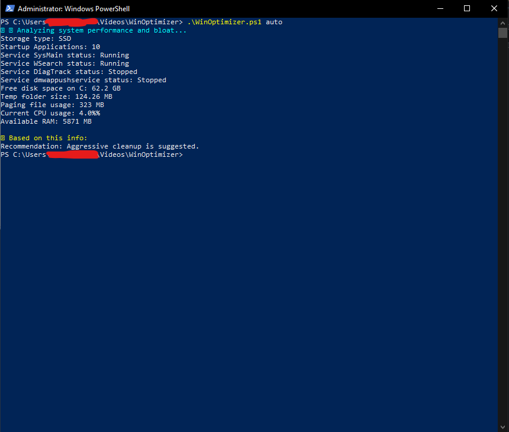
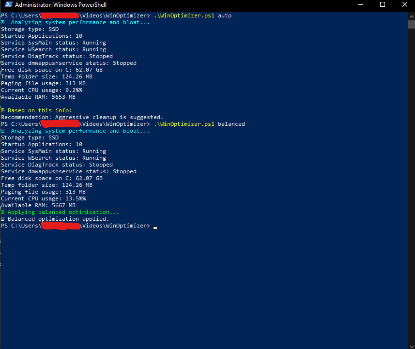

# WinOptimizer 💻✨


## 📌 Overview
WinOptimizer is a PowerShell-based Windows system performance analyzer and optimizer.  
It scans your system to detect storage type, startup apps, key services, disk usage, CPU & RAM usage, and recommends or applies optimizations to boost performance.

---

## 🚀 Features
- Auto-detects SSD/HDD storage type  
- Analyzes startup applications and service status  
- Measures temp folder size, paging file usage, and CPU/RAM availability  
- Provides recommendations (auto mode) or applies optimizations with balanced, aggressive, or rollback modes

---

## 📸 Screenshots
### Analysis Mode  


### Recommendation Output  


---

## 📂 Installation
Clone the repository:

```powershell
git clone https://github.com/dirgarahman/WinOptimizer.git
cd WinOptimizer
```

---

## ⚙️ Usage
```powershell
# Run bypass scope policy
Set-ExecutionPolicy Bypass -Scope Process -Force

# Run in auto mode to analyze and get recommendations:
.\WinOptimizer.ps1 auto

# Run in balanced mode for mild optimization (clears temp files, disables diagtrack):
.\WinOptimizer.ps1 balanced

# Run in aggressive mode for full cleanup (disables heavy services, clears temp):
.\WinOptimizer.ps1 aggressive

# Rollback changes:
.\WinOptimizer.ps1 rollback
```

---

## 🛠 Contribution
Feel free to fork the repo and send pull requests. Please make sure to:

 - vWrite clear commit messages

 - Test your changes thoroughly

 - Follow PowerShell scripting best practices

---

## 📜 License
This project is licensed under the MIT License — see the [LICENSE](LICENSE) file for details.

---

**Author:** [Dirga Rahman](https://github.com/dirgarahman)  
**Version:** 1.0.0
